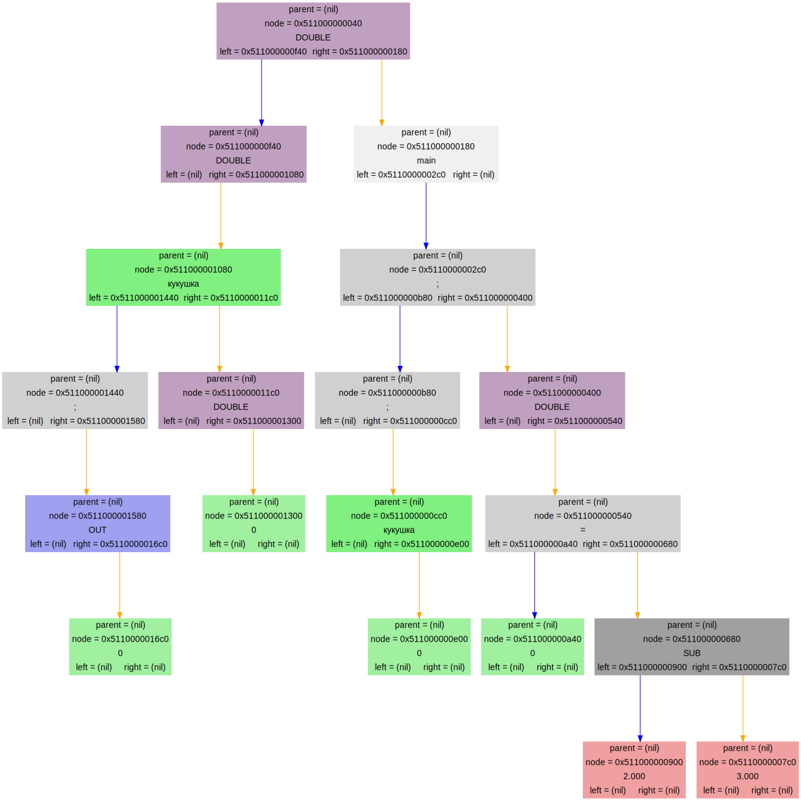

# Язык программирования

Суть задачи заключалась в том, чтобы написать программу, которая бы переводила свой язык программирования в свой ассемблер, а затем запускала его. Реализация моего ассемблера и программ для работы с ним находится в отдельном репозитории под названием [SPU](https://github.com/Dinichthys/SPU).

## Реализация

### Front-end

Сначала происходит считывание текста программы и разбиение её на отдельные лексемы, содержащие тип лексемы (тип данных, переменная, число, операция и т.д.)

Затем по данному массиву лексем строится бинарное дерево синтаксиса (``AST``) с помощью рекурсивного спуска, а затем полученное дерево записывается в отдельный файл.

Все имена функций передаются в ноду дерева, как строки, а переменные заменяются на адреса в таблицах переменных, относительно начала таблицы, созданной в данной области видимости. Для связи таблиц разных областей видимости используется список, прописанный в репозитории [List](https://github.com/Dinichthys/List). С помощью него, таблицы связываются в список, в который их добавляют при начале новой области видимости, и убирают из него при её завершении.

### Back-end

В начале программа считывает дерево из файла, в который оно было записано **Front-end'ом**.

Затем, перед началом перевода в ассемблер программы, в файл, предназначенный для ассемблера, записывается стартовая информация, которая обеспечивает валидное выполнение программы. Она заключается в вызове функции ``main`` и завершении программы после него.

После этого в файл записывается перевод дерева синтаксиса в ассемблер. Имена меток, задающих функции, равняются именам функций в изначальной программе, а все переменные задаются через сдвиг в оперативной памяти, при этом у каждой переменной есть своя область видимости, так как её адрес в оперативной памяти вычисляется относительно начала стекового кадра. Все выражения вычисляются через стек, а присваивание происходит путём инструкции ``pop`` из стека.

### Dump

Для отладки можно вызвать отрисовку дерева синтаксиса с помощью функции
``` C
enum LangError DumpLang (node_t* const root);
```
В ней ``root`` - это корень этого бинарного дерева.

Пример построенного дерева:



## Использование

Для начала напишите программу в отдельном файле в соответствии с синтаксисом языка ``C`` и таблицей ключевых слов, расположенных в [данном файле](libs/read_lang.h). Затем выполните команду:

``` bash
./front -i Имя_программы.to -o Файл_для_вывода_дерева.piym
```
Или можно использовать ``make frontend``, если Вы писали в файле с именем ``Program.to``

Для перевода программы в ассемблер используйте команду:

``` bash
./back -i Файл_для_вывода_дерева.piym -l log/log.txt -o Файл_для_вывода_ассемблера.asm
```
Или можно использовать ``make backend``, если Вы писали воспользовались ``make frontend``.


``` bash
	src/SPU/compiler Файл_для_вывода_ассемблера.asm Файл_с_бинарным_представлением.txt
```
Или можно использовать ``make compile``, если Вы писали воспользовались ``make backend``.


``` bash
	src/SPU/processor Файл_с_бинарным_представлением.txt
```
Или можно использовать ``make run``, если Вы писали воспользовались ``make compile``.


#### Ваша программа запущена!

## Возвращаемые значения функций

|Имя ошибки                  | Её номер | Её значение
|:---:                       |:---:     |:---:
|kDoneLang                   | 0        | Корректное завершение программы
|kCantAddNode                | 1        | Невозможно добавить ноду в лексическом анализе
|kCantCreateNode             | 2        | Невозможно создать ноду
|kInvalidFileName            | 3        | Несуществующий файл
|kCantReadDataBase           | 4        | Не получилось считать базу данных, где записано дерево
|kCantCallocInputBuffer      | 5        | Невозможно выделить память под буфер для ввода
|kCantCallocTokenBuf         | 6        | Невозможно выделить память для буфера токенов при разбиении текста программы на токены
|kCantOpenDataBase           | 7        | Невозможно открыть базу данных, где записано дерево
|kNoBraceCloser              | 8        | Нет закрывающей скобки в программе
|kUndefinedFuncForRead       | 9        | Вызов, неопределённой до этого момента, функции
|kSyntaxError                | 10       | Синтаксическая ошибка, неизвестная переменная
|kCantDivideByZero           | 11       | Невозможно деление на ноль
|kInvalidTokenForExpression  | 12       | Неправильный порядок ключевых слов в выражении
|kInvalidAssigning           | 13       | Неверное присваивание
|kInvalidCommand             | 14       | Невозможная в данном контексте команда
|kInvalidPatternOfFunc       | 15       | Невозможный шаблон функции
|kMissTypeInGlobal           | 16       | Пропущен тип у глобальной переменной или функции
|kCantCreateListOfTables     | 17       | Невозможно создать список таблиц переменных
|kTooManyVar                 | 18       | Слишком много переменных в программе
|kInvalidTokenType           | 19       | Невозможный тип лексемы в массиве
|kUndefinedVariable          | 20       | Неопределённая до этого места в программе, переменная
|kMissCommaFuncCall          | 21       | Пропущена запятая в аргументах в вызове функции
|kMissCommaInArgs            | 22       | Пропущена запятая в аргументах в описании функции
|kCantDumpLang               | 23       | Не удалось вызвать описание дерева программы
|kInvalidNodeTypeLangError   | 24       | Неверный тип ноды в дереве
|kInvalidPrefixDataBase      | 25       | Неверный тип ноды прописан в базе данных, где записано дерево
|kMissValue                  | 26       | Пропущено значение в базе данных, где записано дерево
